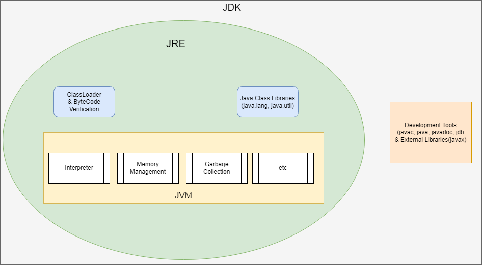

# Java Questions

## 1. What is JDK ?

The JDK (Java Development Kit) is a superset of the JRE, providing everything needed for Java application development.

Key Components
- JRE: Includes a complete Java Runtime Environment.
- Development Tools:
  - javac: The Java compiler
  - java: The Java application launcher
  - javadoc: Documentation generator
  - jdb: Java debugger
- Additional Libraries: Extra APIs for development (e.g., javax packages).

## 2. What is JRE ?
The JRE (Java Runtime Environment) is the minimum environment required to execute a Java application. It consists of the JVM, core libraries, and other supporting files.

Components
- JVM: An implementation of the JVM specification for a particular platform.
- Core Libraries: Essential Java API classes (e.g., java.lang, java.util).
- Supporting Files: Configuration files and resources needed for Java applications.

## 3. What is JVM and how it works ?

The JVM (Java Virtual Machine) is the cornerstone of Java’s “write once, run anywhere” philosophy. It’s an abstract computing machine that provides a runtime environment in which Java bytecode can be executed.

Key Functions
- Bytecode Interpretation: Translates Java bytecode into machine-specific instructions.
- Memory Management: Handles memory allocation and deallocation, including garbage collection.
- JIT Compilation: Compiles frequently executed bytecode to native machine code for improved performance.
- Exception Handling: Manages the execution of try-catch blocks and handles runtime exceptions.
- Security: Implements the Java security model to protect against malicious code.

The JVM (Java Virtual Machine) workflow involves several key steps that allow Java applications to be executed across various platforms. Here’s a breakdown of the JVM workflow:

1. **Compilation of Java Code to Bytecode**
   Java source code (.java files) is written by the developer and compiled by the Java compiler (javac) into bytecode (.class files).
   Bytecode is an intermediate, platform-independent code that the JVM can understand and process.
2. **Class Loading**
   The Class Loader is the first component in the JVM runtime to load .class files. It loads bytecode into the JVM memory, usually upon first reference.
   The class loader handles tasks like finding and loading classes, ensuring that each class is loaded only once, and managing dependencies between classes.
3. **Bytecode Verification**
   The Bytecode Verifier checks the loaded bytecode for security and correctness, ensuring it follows JVM rules (such as type safety).
   This prevents issues like memory corruption or illegal bytecode operations, protecting the JVM from malformed or malicious code.
4. **Interpretation and Execution**
   After verification, the JVM Interpreter begins to execute the bytecode instruction by instruction.
   Each bytecode instruction is interpreted and translated into native machine code for the host system, allowing immediate execution.
   Interpretation makes the JVM slower than native execution initially but enables platform independence.
5. **Just-In-Time (JIT) Compilation**
   The JVM’s Just-In-Time (JIT) Compiler identifies frequently executed bytecode (hot spots) and compiles these into optimized machine code.
   This compiled machine code is then cached, so future executions bypass interpretation, improving performance significantly.
   The JIT compiler works in conjunction with the interpreter to dynamically optimize the program as it runs, balancing speed and memory use.
6. **Execution Engine**
   The Execution Engine is responsible for the actual execution of instructions, whether they come from the interpreter or the JIT-compiled machine code.
   The execution engine interacts with the underlying operating system and hardware to carry out operations like arithmetic calculations, memory management, and system calls.
7. **Memory Management (Heap and Stack)**
   The JVM allocates and manages memory through Heap (for objects and class instances) and Stack (for method-level execution and primitive data).
   Garbage Collection (GC) is a part of memory management that periodically reclaims memory occupied by objects no longer in use. This helps prevent memory leaks and improves application efficiency.
8. **Runtime Data Areas**
   The JVM organizes memory into several runtime data areas:
   - Method Area: Stores class structures like runtime constant pool, field and method data, and bytecode of methods.
   - Heap: Stores objects and arrays created at runtime.
   - Stack: Holds frames for each method call, including local variables and partial results.
   - Program Counter (PC) Register: Keeps track of the address of the current instruction being executed.
   - Native Method Stack: Used for native (non-Java) methods executed by the JVM.
9. **Garbage Collection**
   The Garbage Collector (GC) runs automatically, identifying and freeing up memory occupied by objects that are no longer reachable.
   This process helps in efficient memory management and keeps memory clean by removing unnecessary data, though it may momentarily impact performance.
10. **Native Interface (JNI)**
    The JVM can interact with native applications and libraries written in other languages (like C or C++) through the Java Native Interface (JNI).
    JNI enables Java applications to use platform-specific functionality not provided directly by the Java libraries.
11. **Termination**
    Once the program has completed execution, the JVM performs any necessary cleanup, releasing resources and preparing for shutdown.

**Summary of JVM Workflow**
- Java code (.java) → Bytecode (.class) via the compiler.
- Class Loading by the Class Loader.
- Bytecode Verification for security.
- Interpretation of bytecode by the Interpreter.
- Just-In-Time (JIT) Compilation for hot code optimization.
- Execution Engine runs the bytecode or compiled machine code.
- Memory Management and Garbage Collection.
- Runtime Data Areas manage memory structure.
- JNI allows calls to native code.
- Termination cleans up resources.

