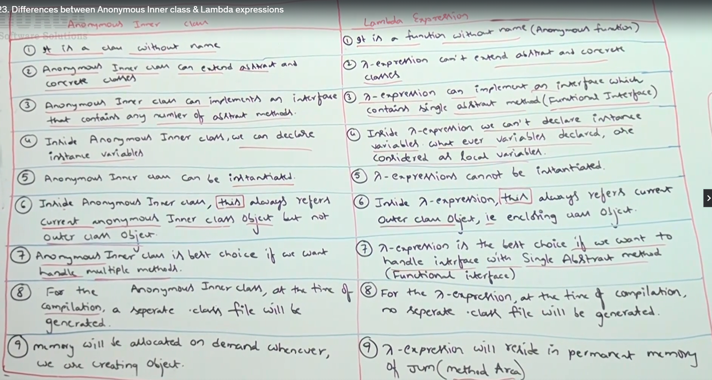
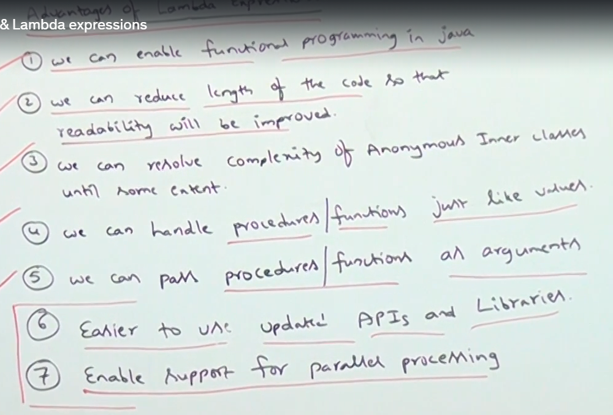

## Anonymous Inner CLasses

An anonymous inner class in Java is a special type of inner class without a name. It is typically used when you need to create an instance of a class with certain modifications, such as overriding methods, without formally subclassing it.

### Key Characteristics
- No explicit class name: It is declared and instantiated in a single statement.
- Used for subclassing or implementing interfaces: Typically, it is used to create a subclass of an abstract class or implement an interface.
- Scope and one-time use: It is defined and used in one place, making the code concise.
- Cannot define constructors: Because it has no name, constructors cannot be explicitly defined.

### How to Create an Anonymous Inner Class

#### 1. Extending a Class

```
abstract class Animal {
    abstract void makeSound();
}

public class Main {
    public static void main(String[] args) {
        Animal animal = new Animal() {
            @Override
            void makeSound() {
                System.out.println("Anonymous Inner Class: Roar!");
            }
        };
        animal.makeSound();
    }
}

```
#### 2. Implementing an Interface
You can also create an anonymous inner class that implements an interface.

````
interface Greeting {
    void sayHello();
}

public class Main {
    public static void main(String[] args) {
        Greeting greeting = new Greeting() {
            @Override
            public void sayHello() {
                System.out.println("Anonymous Inner Class: Hello!");
            }
        };
        greeting.sayHello();
    }
}

````

### Advantages
- Conciseness: Reduces boilerplate code for simple implementations.
- Flexibility: Allows quick modifications of existing behavior.
- Encapsulation: Keeps the logic close to where it is used.

### Comparison with Lambda Expressions

- Anonymous inner classes can be used for both classes and interfaces, whereas lambda expressions are primarily for interfaces with a single abstract method (functional interfaces).
- Lambdas are more concise and preferred for functional interfaces, while anonymous inner classes are better for extending classes or implementing multiple methods.

```
class ThreadDemo {
  public static void main(String[] args) {
    Runnable run = ()-> {
      for (int i =0; i<5; i++) {
        System.out.println("Child Thread");
      }
    };
    Thread thread = new Thread(run);
    thread.start();
    for (int i=0; i<5; i++) {
      System.out.println("Main Thread");
    }
  }
}
```
- Anonymous inner classes can extend concrete classes, abstract classes or interface with multiple methods but lambda expression can't support this.
```
//Simple Implementation (Without Anonymous Class)

class Animal {

  void speak() {
    sout("Animal Speaks")
  }

  void eat() {
    sout("Animal eats")
  }

}

class Dog extends Animal {

  @Override
  void speak() {
    sout("Dog barks")
  }

}

class Main {
  public static void main(String[] args) {

    Animal an = new Dog();
    an.speak(); //Output: Dog barks.
    an.eat(); //Output: Animal eats

  }
}

```

```
//Implementation using Anonymous Class

class Animal {

  void speak() {
    sout("Animal speaks");
  }

  void eats() {
    sout("Animal eats");
  }

}

class Main {

  public static void main(String[] args) {

    Animal an = new Animal() {

      @Override
      void speak() {
        sout("Dog barks");
      }

    };
    an.speak(); //Output: Dog barks.
    an.eat(); //Output: Animal eats

  }
}
```

- Anonymous innner class can have its own instance variables. Because it has its own scope and acts as a fully-fledged class.
  this keyword will always refer to the current inner class instance variable. 

```
public class Main {

  public static void main(String[] args) {
    int count = 5;

    Runnable rn = new Runnable() {
       int count = 0;

      @Override
      public void run() {
        count++;
        System.out.println("Anonymous inner class count: " + this.count);

      }
    };

    rn.run(); // Output: Anonymous Inner Class Count: 1
    rn.run(); // Output: Anonymous Inner Class Count: 2

  }

}

```

- Lambda expression cannot declare new instance variables. It can have local variables.
  Can access effectively final variables from the enclosing scope.
  Mutable state can be achieved using external objects or arrays..

```
public class Main {

  int count =20;
  
  void test() {
    
    Runnable rn = () -> {
       int count = 10;
       System.out.println("Anonymous inner class count: " + this.count); // output : 20
    };
    rn.run();
    }

  public static void main(String[] args) {
    Main mn = new Main();
    mn.test();

  }
  
}

```
 
- Lambdas can only use count if it is effectively final. Modifying count (e.g., count++) would break this constraint.

```
public class Main {
    public static void main(String[] args) {
        int count = 0; // Effectively final variable

        Runnable task = () -> {
            // count++; // Error: Variable used in lambda should be final or effectively final
            System.out.println("Count is: " + count);
        };

        task.run(); // Output: Count is: 0
    }
}
```

-  The array count provides mutable state that the lambda can modify. This mimics the behavior of an instance variable.
```
public class Main {
    public static void main(String[] args) {
        // Using an array to simulate an instance variable
        int[] count = {0};

        Runnable task = () -> {
            count[0]++;
            System.out.println("Count is: " + count[0]);
        };

        task.run(); // Output: Count is: 1
        task.run(); // Output: Count is: 2
    }
}
```

- Here, Counter acts as a container for mutable state, similar to an instance variable
```
public class Main {
    public static void main(String[] args) {
        // Wrapper class to hold the mutable state
        class Counter {
            int value = 0;
        }

        Counter counter = new Counter();

        Runnable task = () -> {
            counter.value++;
            System.out.println("Counter value is: " + counter.value);
        };

        task.run(); // Output: Counter value is: 1
        task.run(); // Output: Counter value is: 2
    }
}
```

### Difference between Anonymous Inner Class and Lambda Expressions



### Advantages of Lambda Expressions

